# 🛍️ NOVA - Enterprise E-Commerce Platform (.NET 9 & React 18)

<div align="center">


**NOVA** is an enterprise-grade, high-performance, fully responsive, and Docker-ready E-Commerce platform built with modern web technologies and strictly adhering to **N-Tier Architecture** and Clean Design principles.

</div>

---

## 📑 Table of Contents
1. [Project Architecture & Layer Overview](#-project-architecture--layer-overview)
2. [Tech Stack & Dependencies](#-tech-stack--dependencies)
3. [Key Features](#-key-features)
4. [📸 Application Screenshots](#-application-screenshots)
5. [RESTful API Endpoints](#-restful-api-endpoints)
6. [Frontend State Management (Redux Toolkit)](#-frontend-state-management-redux-toolkit)
7. [🐳 Quick Start with Docker (Recommended)](#-quick-start-with-docker-recommended)
8. [💻 Local Development (Without Docker)](#-local-development-without-docker)
9. [🔑 Default Seed Credentials](#-default-seed-credentials)
10. [📁 Directory Structure](#-directory-structure)
11. [🛡️ Security & Error Handling](#-security--error-handling)

---

## 🏗️ Project Architecture & Layer Overview

The backend is built following **Separation of Concerns (SoC)** and **Clean Architecture** patterns across 5 decoupled layers:

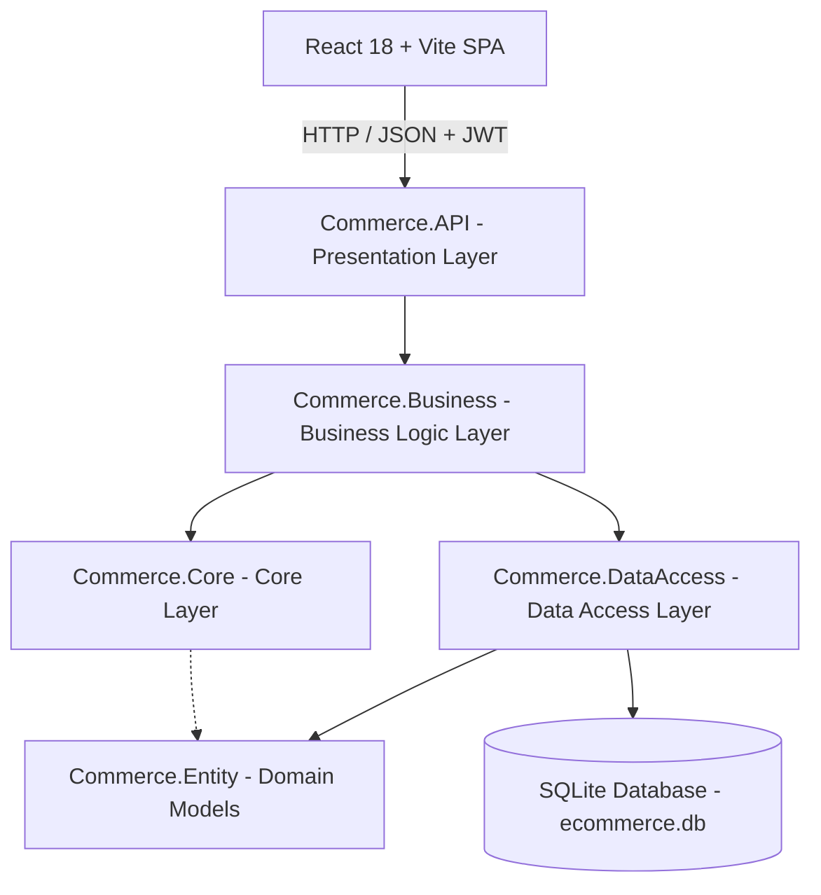

### 1. `Commerce.API` (Presentation Layer)
- **Controllers:** `AccountController`, `ProductsController`, `CategoriesController`, `CartController`, `OrdersController`, `AdminController`.
- **Middleware:** `ExceptionHandlingMiddleware` for global centralized error handling and RFC 7807 compliant Problem Details responses.
- **Swagger / OpenAPI:** Interactive documentation and testing dashboard.
- **CORS Policy:** Secure cross-origin resource sharing configured for client applications.

### 2. `Commerce.Business` (Business Logic Layer)
- **Services:** `AuthService`, `ProductService`, `CategoryService`, `CartService`, `OrderService`, `AdminService`.
- **Business Rules:** Stock validation, cart merging algorithms, checkout validation, and role-based permissions.
- **AutoMapper:** Automated object mapping between Entity models and DTOs.

### 3. `Commerce.Core` (Core / Shared Layer)
- **DTOs:** `LoginDto`, `RegisterDto`, `ProductDto`, `CartDto`, `OrderDto`, `UserDto`, `ChangePasswordDto`.
- **Interfaces:** Abstractions for repositories and application services.
- **Custom Exceptions:** `NotFoundException`, `BadRequestException`, `UnauthorizedException`.

### 4. `Commerce.DataAccess` (Data Access Layer)
- **Entity Framework Core 9:** Database context (`CommerceDbContext`), table relationships, Fluent API mappings, and cascade delete rules.
- **SeedData:** Automated database seeding for roles, admin/worker/customer accounts, product categories, and sample catalog items.

### 5. `Commerce.Entity` (Domain Entities)
- `AppUser` & `AppRole` (ASP.NET Core Identity)
- `Product` (Name, Description, Price, Stock, ImageUrl, Category relationships)
- `Category` (Category Name, Product relationships)
- `Cart` & `CartItem` (Customer shopping cart and items)
- `Order` & `OrderItem` (Order details, shipping addresses, order status, total price)

---

## 🚀 Tech Stack & Dependencies

### 🔙 Backend
- **Target Framework:** .NET 9.0 SDK (`net9.0`)
- **API Framework:** ASP.NET Core Web API
- **ORM:** Entity Framework Core 9.0
- **Database:** SQLite 3 (`ecommerce.db`)
- **Authentication:** ASP.NET Core Identity + JWT Bearer Tokens
- **API Documentation:** Swashbuckle Swagger UI 6.5
- **Mapping:** AutoMapper 12.0

### 🔜 Frontend
- **Framework & Language:** React 18.3 & TypeScript 5.6
- **Build Tool:** Vite 5.4
- **State Management:** Redux Toolkit 2.2 + React-Redux
- **UI Library:** Material-UI (MUI v5), `@mui/icons-material`
- **Routing:** React Router DOM v6
- **HTTP Client:** Axios (Automatic Bearer Token Interceptor & 401 Auto-Redirect)
- **Notifications:** React-Toastify
- **Responsiveness:** 100% Responsive layout for Mobile, Tablet, and Desktop devices

### 🐳 DevOps & Containers
- **Containerization:** Docker & Docker Compose (Multi-stage build)
- **Production Server:** Nginx (Alpine Linux, SPA routing fallback & reverse proxy)

---

## 🌟 Key Features

### 👤 1. Authentication & Role-Based Authorization
- **JWT Bearer Authentication:** Secure, stateless API authentication.
- **Multi-Tier Role Hierarchy:**
  - `Admin`: Full system control (Orders, Users, Catalog CRUD, Role Management).
  - `Worker`: Staff access (Order status management, Catalog management).
  - `Customer`: Shopping, Cart, Wishlist, Checkout, Address & Order tracking.
- **Profile Management:** Personal info update, multi-address management, past order history, and password changes.

### 🛍️ 2. Product Catalog & Smart Discovery
- **Category Filtering:** Seamless one-click category filtering.
- **Live Search (Debounced):** Real-time product search by name and description.
- **Rich Product Cards:** Dynamic badges (`En Çok Satan` / Best Seller), user rating stars, wishlist heart toggle, and instant Add-to-Cart.
- **Comprehensive Product Details:** Multi-image gallery, real-time stock indicator, shipping details, seller information, dynamic quantity selector, and description panel.

### 🛒 3. Dynamic Cart System
- **Real-Time Calculations:** Instant recalculation of subtotal, shipping fees, and grand total upon quantity changes.
- **Free Shipping Threshold:** Automatic free shipping when cart total exceeds 1,500 TL.
- **Persistence:** Authenticated user carts are synced with the database.

### 💳 4. 3-Step Checkout Wizard
- **Step 1 - Address & Delivery:** Select existing saved address or add new delivery address (Name, Phone, City, Full Address, Shipping option).
- **Step 2 - Payment:** Simulated credit/debit card validation (Cardholder Name, 16-digit Card Number, Expiry Date, CVV).
- **Step 3 - Order Confirmation:** Unique order tracking code generation (e.g. `NOV-930103`), summary recap, and success confirmation.

### ❤️ 5. Favorites & Wishlist
- Add or remove items to/from wishlist with persistent state.
- One-click transfer from wishlist directly into the cart.

### 🛡️ 6. Admin & Worker Dashboard
- **Order Management:** Filter and update customer order lifecycle:
  - `Hazırlanıyor` (Processing) ⏳
  - `Yolda / Kargoda` (Shipped) 🚚
  - `Teslim Edildi` (Delivered) ✅
  - `İptal Edildi` (Cancelled) ❌
- **User Management:** View registered users, emails, and assigned roles.
- **Product Management:** Add, edit, or delete catalog items and manage inventory stocks.

---

## 📸 Application Screenshots

### 1. Home Page & Product Catalog
Category navigation bar, global search, and dynamic responsive product cards.

| Home Page (Catalog View) |
| :---: |
| 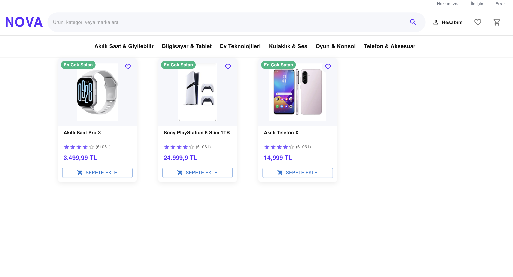 |

---

### 2. Authentication (Login & Register)
Secure JWT-powered authentication forms with validation feedback.

| Login Form | Register Form |
| :---: | :---: |
| 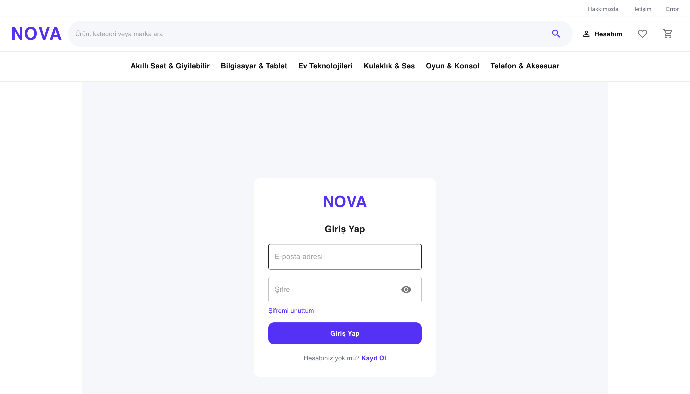 | 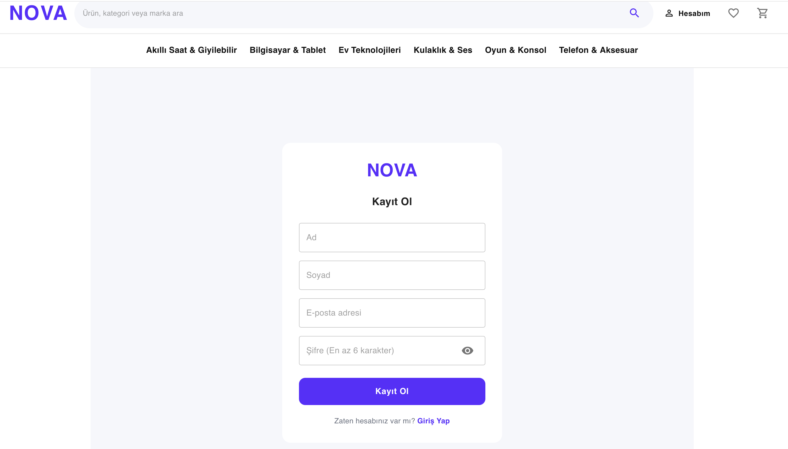 |

---

### 3. Product Details Page
Product image showcase, stock availability, ratings, and instant purchase panel.

| Product Detail & Buy Panel |
| :---: |
| 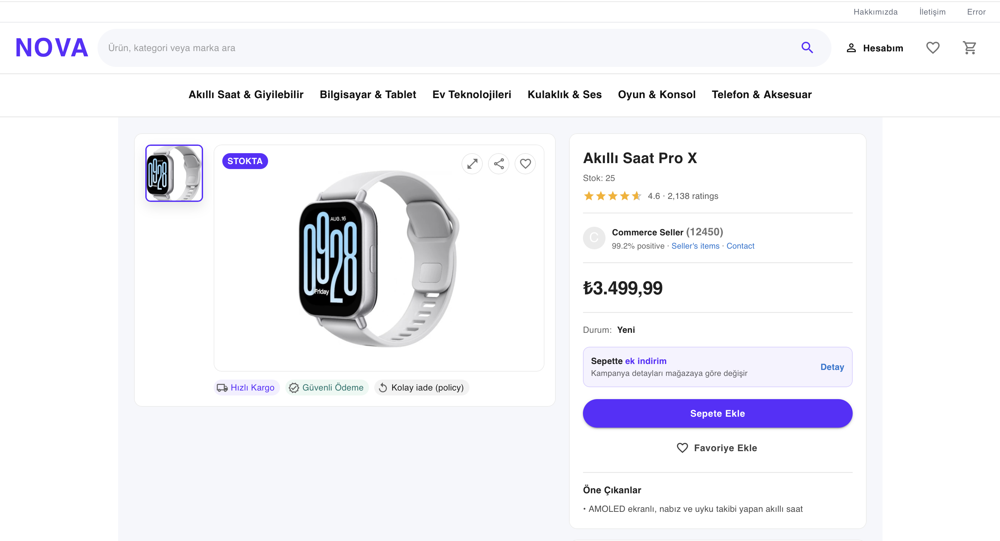 |

---

### 4. Cart & 3-Step Checkout Wizard
Cart overview, dynamic quantity management, delivery address selection, and card payment.

| Shopping Cart | 1. Address & Delivery Info |
| :---: | :---: |
| 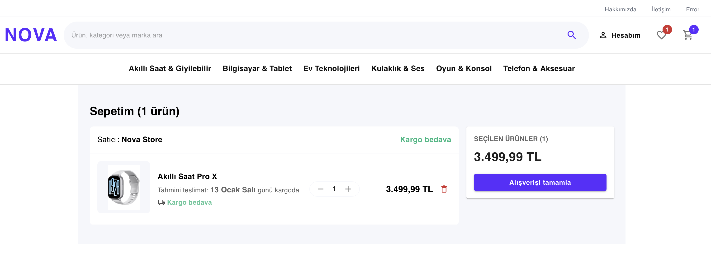 | 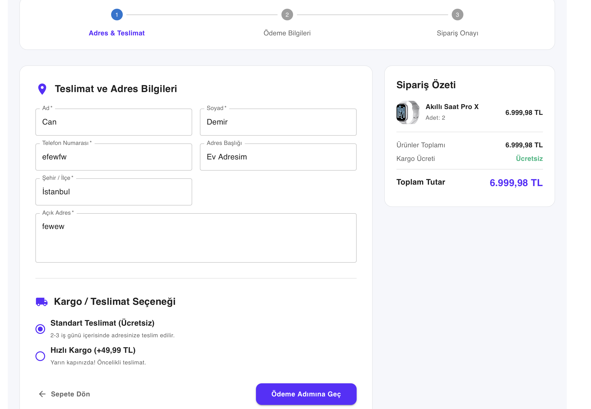 |

| 2. Credit Card Payment |
| :---: |
| 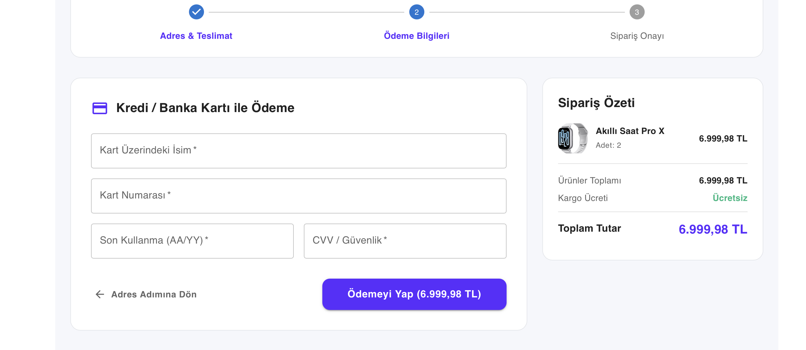 |

---

### 5. Wishlist & User Profile Management
Saved favorite items, profile overview, saved delivery addresses, order history, and security settings.

| Favorites / Wishlist | Customer Profile Panel |
| :---: | :---: |
| 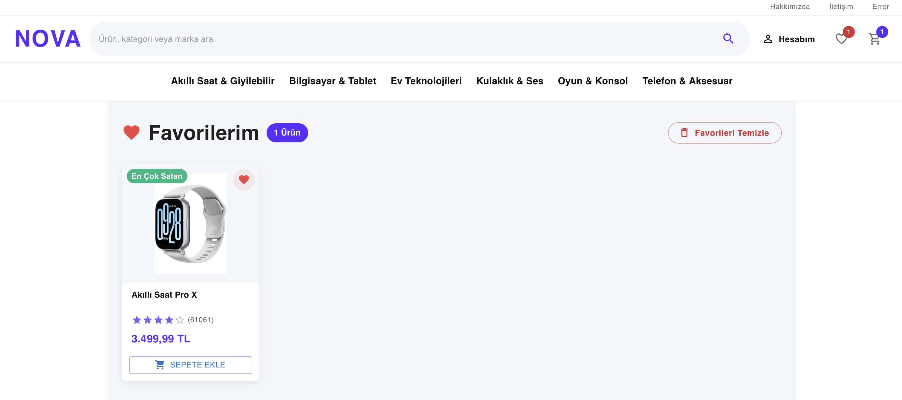 | 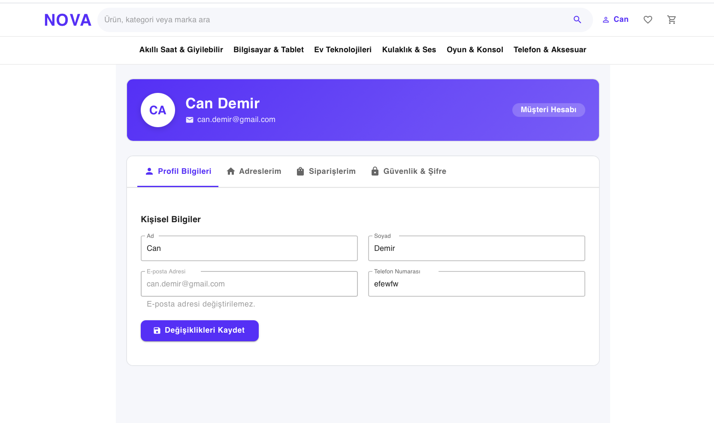 |

---

### 6. Administration Panel (Worker & Admin Dashboard)
Customer order tracking, real-time status updates, registered users, and inventory control.

| Order Management Dashboard |
| :---: |
| 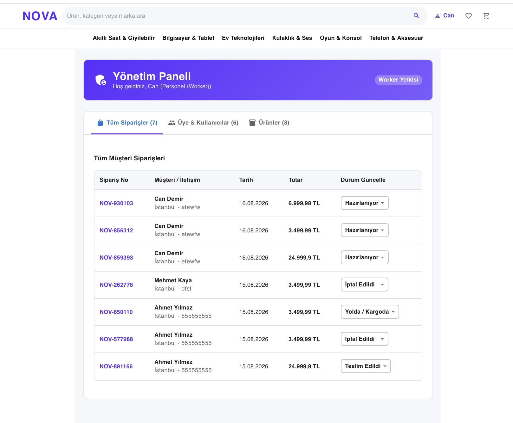 |

---

## 📡 RESTful API Endpoints

### 🔐 Authentication & Profile (`/api/account`)
| Method | Endpoint | Authorization | Description |
| :--- | :--- | :--- | :--- |
| `POST` | `/api/account/login` | Anonymous | Authenticates user & returns JWT Bearer token |
| `POST` | `/api/account/register` | Anonymous | Registers a new customer account |
| `GET` | `/api/account/current-user` | Authenticated | Retrieves current user session data |
| `PUT` | `/api/account/profile` | Authenticated | Updates personal profile information |
| `POST` | `/api/account/change-password`| Authenticated | Updates account password |

### 📦 Products & Categories (`/api/products` & `/api/categories`)
| Method | Endpoint | Authorization | Description |
| :--- | :--- | :--- | :--- |
| `GET` | `/api/products` | Anonymous | Fetches all products (Supports filters & search) |
| `GET` | `/api/products/{id}` | Anonymous | Fetches product details by ID |
| `POST` | `/api/products` | Worker / Admin | Creates a new product |
| `PUT` | `/api/products/{id}` | Worker / Admin | Updates product information |
| `DELETE`| `/api/products/{id}` | Admin | Deletes a product from the catalog |
| `GET` | `/api/categories` | Anonymous | Lists all available product categories |

### 🛒 Shopping Cart (`/api/cart`)
| Method | Endpoint | Authorization | Description |
| :--- | :--- | :--- | :--- |
| `GET` | `/api/cart` | Customer | Retrieves the active cart for the user |
| `POST` | `/api/cart` | Customer | Adds an item to the cart or increments quantity |
| `DELETE`| `/api/cart` | Customer | Clears all items in the cart |
| `DELETE`| `/api/cart/items/{id}` | Customer | Removes a specific item from the cart |

### 🚚 Orders & Administration (`/api/orders` & `/api/admin`)
| Method | Endpoint | Authorization | Description |
| :--- | :--- | :--- | :--- |
| `GET` | `/api/orders` | Customer | Retrieves user's order history |
| `POST` | `/api/orders` | Customer | Places a new order (Completes checkout) |
| `GET` | `/api/orders/{id}` | Customer | Gets specific order details |
| `GET` | `/api/admin/orders` | Worker / Admin | Lists all customer orders across the platform |
| `PUT` | `/api/admin/orders/{id}/status` | Worker / Admin | Updates order lifecycle status |
| `GET` | `/api/admin/users` | Admin | Lists all registered accounts in the system |

---

## 🧠 Frontend State Management (Redux Toolkit)

Application state is globally managed via Redux Toolkit slices:

- **`accountSlice`**: Handles user authentication, token storage, user roles (`isAdmin`, `isWorker`), and profile state.
- **`catalogSlice`**: Holds products fetched from the API, active category filter, and search queries.
- **`cartSlice`**: Tracks shopping cart items, item counts, subtotal, and checkout steps.
- **`favoriteSlice`**: Manages wishlist item IDs and persists favorite products.

```typescript
// Automatic JWT Bearer Token Interceptor
api.interceptors.request.use((config) => {
  const token = store.getState().account.user?.token;
  if (token) {
    config.headers.Authorization = `Bearer ${token}`;
  }
  return config;
});
```

---

## 🐳 Quick Start with Docker (Recommended)

The entire application (.NET 9 Backend, React 18 Frontend, SQLite Database) is pre-configured to run with a single Docker command.

### 📌 Prerequisites
- [Docker Desktop](https://www.docker.com/products/docker-desktop/) installed and running.

### 🚀 1. Start Containers
Run the following command in the root project directory:

```bash
docker compose up -d --build
```

> **What happens under the hood?**
> 1. `backend`: Compiles the .NET 9 API using the official `mcr.microsoft.com/dotnet/sdk:9.0` image and exposes port `5232`.
> 2. `frontend`: Compiles the React SPA using `node:20-alpine` and serves it via `nginx:alpine` on ports `80` and `5173`.
> 3. `volumes`: Mounts `ecommerce.db` and `wwwroot` to ensure **database and media files persist across container restarts**.

### 🌐 2. Access the Application
- **Frontend Web UI:** [http://localhost:5173](http://localhost:5173) or [http://localhost](http://localhost)
- **Swagger API Docs:** [http://localhost:5232/swagger](http://localhost:5232/swagger)
- **API Endpoint:** [http://localhost:5232/api/categories](http://localhost:5232/api/categories)

### 🛑 3. Managing Containers
```bash
# Check status of running containers:
docker compose ps

# View live application logs:
docker compose logs -f

# Stop and remove containers:
docker compose down
```

---

## 💻 Local Development (Without Docker)

If you prefer to run the application directly on your local machine:

### Prerequisites
- [.NET 9 SDK](https://dotnet.microsoft.com/download/dotnet/9.0)
- [Node.js](https://nodejs.org/) (v18 or higher)

### 1. Run Backend
```bash
cd e-commerce-Backend/commerce.API
dotnet restore
dotnet run
```
The API will start at `http://localhost:5232`. Database tables and seed data will be automatically applied on startup.

### 2. Run Frontend
```bash
cd e-commerce-Fronted/Client
npm install
npm run dev
```
The React development server will start at `http://localhost:5173`.

---

## 🔑 Default Seed Credentials

The database is pre-seeded with three demo accounts representing each user role:

| Role | Email | Password | Permissions |
| :--- | :--- | :--- | :--- |
| **Admin** | `mehmet.kaya@gmail.com` | `Admin@2024` | **Full Admin:** All orders, users, catalog CRUD, role management |
| **Worker** | `can.demir@gmail.com` | `Worker@2024` | **Staff Member:** Order status updates, product management |
| **Customer** | `ahmet.yilmaz@gmail.com` | `Customer@2024` | **Customer:** Catalog browsing, cart, checkout, order tracking |

---

## 📁 Directory Structure

```
dotnet-react-e-commerce/
├── Images/                       # Application module screenshots (01 - 10)
├── docker-compose.yml            # Multi-container Docker Compose file
├── .dockerignore                 # Docker build ignore specifications
├── README.md                     # Comprehensive project documentation
│
├── e-commerce-Backend/           # .NET 9 N-Tier Web API
│   ├── Dockerfile                # Multi-stage .NET 9 SDK & ASP.NET runtime Dockerfile
│   ├── commerce.API/             # Controllers, Middlewares, Swagger, CORS, wwwroot
│   ├── Commerce.Business/        # Services, Business Logic, AutoMapper Profiles
│   ├── Commerce.Core/            # DTOs, Repository/Service Interfaces, Exceptions
│   ├── Commerce.DataAccess/      # EF Core 9, SQLite DbContext, Migrations, SeedData
│   └── Commerce.Entity/          # AppUser, Product, Category, Order, Cart entities
│
└── e-commerce-Fronted/
    └── Client/                   # React 18 + Vite + TypeScript Client
        ├── Dockerfile            # Multi-stage Node 20 + Nginx production Dockerfile
        ├── nginx.conf            # Nginx SPA fallback routing & reverse proxy
        ├── package.json          # Dependencies and build scripts
        └── src/
            ├── Api/              # Axios Interceptor & HTTP services
            ├── Features/         # Modular Features (Account, Admin, Cart, Checkout, Catalog)
            ├── Layout/           # Header, Footer, Mobile Drawer & Responsive Layout
            ├── Model/            # TypeScript interface definitions
            ├── Router/           # React Router DOM v6 route definitions
            └── store/            # Redux Toolkit Store & Slices
```

---

## 🛡️ Security & Error Handling

1. **JWT Authentication & Claims:** User identities and role claims (`Admin`, `Worker`, `Customer`) are signed and verified on every protected request.
2. **Global Centralized Exception Handling:** Unhandled exceptions are intercepted by `ExceptionHandlingMiddleware` and formatted into standardized RFC 7807 Problem Details JSON.
3. **CORS Security:** Restricts unauthorized cross-origin requests.
4. **401 Unauthorized Interceptor:** Automatically redirects users to the login screen when session tokens expire or become invalid.
5. **SQL Injection & XSS Protection:** Parameterized queries via EF Core 9 prevent SQL injection vulnerabilities.

---

<div align="center">
  Developed by <strong>Ömer Faruk Şahan</strong> • .NET 9 & React 18 Full Stack E-Commerce Solution
</div>
